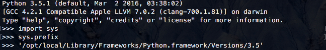
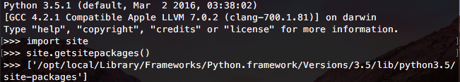

# python

python virtualenv pip 


---
# Python虚拟环境（pyvenv、virtualenv)

**我们为什么需要使用虚拟环境？**

Python的包（或模块）的下载保存非常独特；有时候可能会带来问题。

不同系统，Python模块的安装位置也不一样。例如，大多数系统模块安装在 sys.prefix 环境变量指定的目录中，以Mac OS X为例：



使用pip或easy_install安装的第三方模块通常安装在 site packages 目录：



**下面举一个实际的例子来说明使用虚拟环境的好处。**

假设你有两个Python项目－A和B，这两个项目都需要使用同一个第三方模块－tensorflow。如果这两个项目使用相同的tensorflow版本，也许不会有什么问题。

但是，当A和B项目使用不同的tensorflow版本时－A使用tensorflow 0.70版本；B使用tensorflow 0.80版本。由于Python导入模块不能区分模块版本，导致A、B不能使用tensorflow的不同版本，这在很多情况下是不能接受的。

使用虚拟环境的另一个好处是：保持开发环境的简洁、有序。

**什么是Python虚拟环境？**

Python虚拟环境可以为项目创建相互独立的开发环境，也就是你可以为每个项目安装各自使用依赖模块。

使用虚拟环境可以很好的解决上面A、B项目遇到的问题：为A、B项目分别创建虚拟环境，然后在各自的虚拟环境中安装不同的tensorflow版本。

使用虚拟环境需要借助virtualenv或pyvenv，它们的使用非常简单。

**安装virtualenv、pyvenv**

如果你使用Python 2，你可以使用pip安装virtualenv：

`$ sudo pip install virtualenv`

如果你使用Python 3，它默认安装了pyvenv。

virtualenv和pyvenv的使用方法类似。由于pyvenv是较新的工具，本帖以它为例。

**创建一个存放虚拟环境的目录：**
```
$ mkdir python-env
$ cd python-env
```
**创建一个虚拟环境：**


---
# pip
https://pip.pypa.io/en/stable/installing/

### Installation
**Do I need to install pip?**

pip is already installed if you're using Python 2 >=2.7.9 or Python 3 >=3.4 binaries downloaded from python.org, but you'll need to upgrade pip.

**Additionally, pip will already be installed if you're working in a Virtual Environment created by [virtualenv](https://packaging.python.org/key_projects/#virtualenv) or [pyvenv](https://packaging.python.org/key_projects/#venv).**

>Installing with get-pip.py

To install pip, securely download [get-pip.py.](https://bootstrap.pypa.io/get-pip.py)

Then run the following:

`python get-pip.py`

>Warning

>Be cautious if you're using a Python install that's managed by your operating system or another package manager. get-pip.py does not coordinate with those tools, and may leave your system in an inconsistent state.
